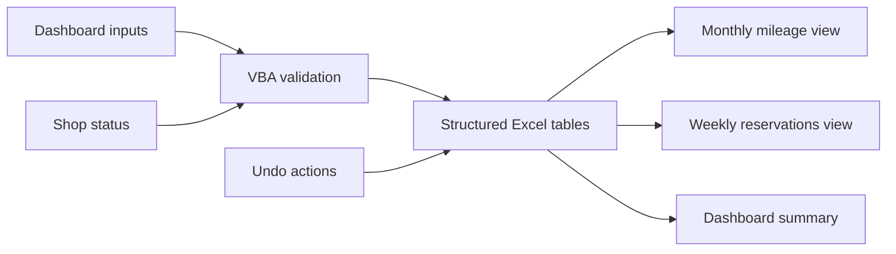

# Architecture

## Design Goals

The application was designed around four priorities:

1. Keep the two primary workflows, mileage entry and vehicle reservation, on one dashboard.
2. Reduce input errors through validation, drop-down choices, and conflict checks.
3. Generate reporting views from structured source tables instead of manual report editing.
4. Keep navigation and refresh operations fast enough for repeated daily use.

## Data Flow

## Workbook Layers

### Presentation Layer

- **Dashboard:** mileage entry, reservation entry, maintenance status, summary KPIs, and navigation.
- **Monthly Mileage:** fiscal-year history organized into monthly blocks with ending odometer values.
- **Weekly Reservations:** Sunday-through-Saturday vehicle schedule with unavailable vehicles identified in the grid.

### Data Layer

The workbook stores records in Excel `ListObject` tables:

- `tblVehicles`
- `tblDrivers`
- `tblReservations`
- `tblMileageLog`

Generated report sheets are outputs. Users work through the dashboard so validation and dependent updates happen together.

### Automation Layer

- `modFleetMileageTool.bas` contains entry validation, table operations, reporting, navigation, maintenance logic, calendars, and protection routines.
- `modFleetDashboardLayout.bas` controls dashboard styling and the fiscal-year/report-month selectors.
- `modFleetUndoActions.bas` reverses the latest mileage or reservation transaction.
- `ThisWorkbook.cls` initializes protection and the dashboard when the workbook opens.
- Worksheet event modules connect cell changes and selections to the corresponding application workflows.

## Key Business Rules

- Ending odometer must be greater than or equal to starting odometer.
- Mileage is logged to a single trip date.
- Reservations may cover a date range and create one controlled row per date.
- End time must be later than start time.
- A vehicle cannot be reserved when it is already booked for that date.
- A vehicle marked for maintenance cannot be reserved until it is made available.
- Monthly and fiscal-year summaries are derived from the underlying tables.
- Output sheets are protected from accidental manual deletion.

## Performance Approach

- Refresh only the affected report area after a transaction.
- Cache the weekly-reservation signature and rebuild only when needed.
- Disable screen updating and events during controlled transitions.
- Restore application state on both success and error paths.
- Keep the dashboard's calendars and selectors shape-based and local to the workbook.

## Sheet Module Map

| VBA component | Worksheet |
|---|---|
| `Sheet1` | Dashboard |
| `Sheet2` | Setup |
| `Sheet3` | Vehicles |
| `Sheet4` | Drivers |
| `Sheet5` | Reservations |
| `Sheet6` | Mileage Log |
| `Sheet7` | DashboardData |
| `Sheet8` | Monthly Mileage |
| `Sheet9` | Weekly Reservations |
| `Sheet10` | Import Summary |

Only the application-facing sheets are visible during normal use. Supporting sheets remain hidden and are manipulated through controlled VBA routines.

