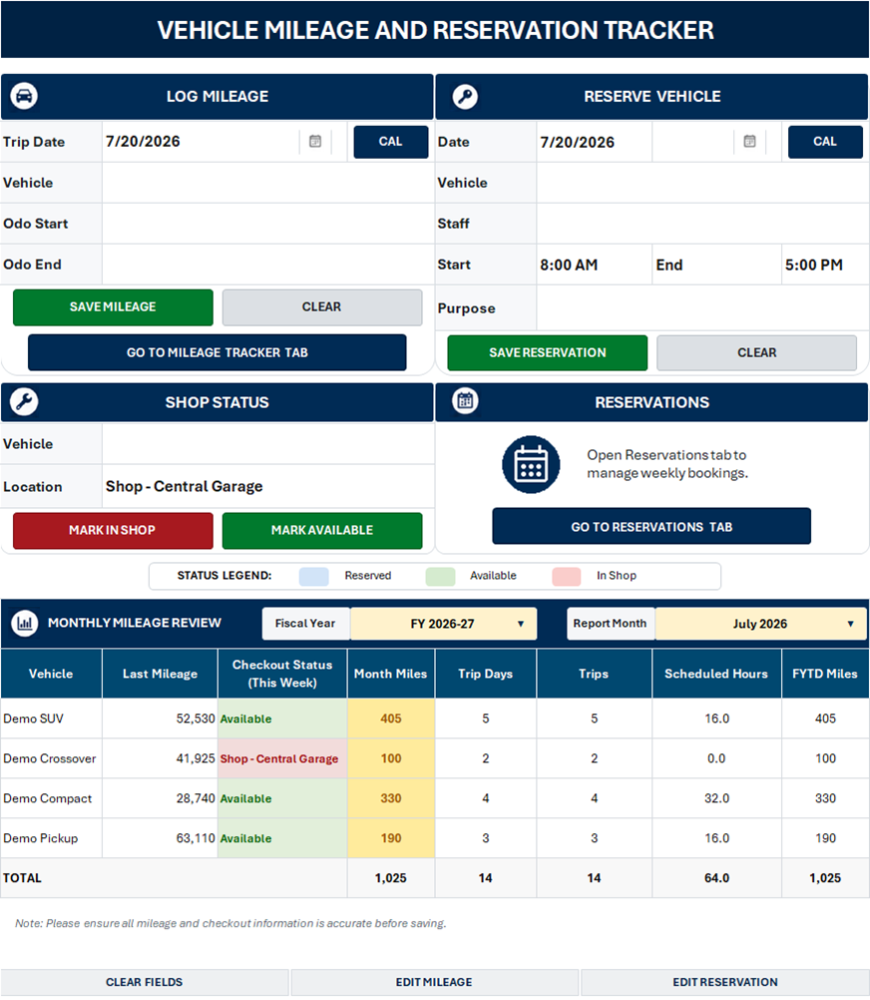
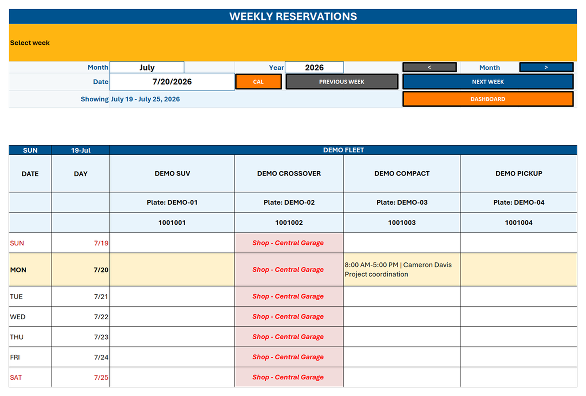
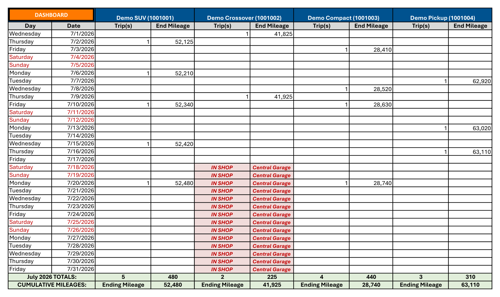

# Vehicle Mileage and Reservation Tracker

An Excel/VBA application for mileage entry, vehicle reservations, maintenance history, operational controls, and management reporting.

**Designed and built end to end by Charles Monsanto.** Charles owned requirements discovery, workflow and control design, VBA implementation, reporting, test design, privacy sanitization, and release documentation.

The initial functional release was delivered within four weeks, progressing from workflow study and requirements through development, testing, stakeholder feedback, and refinement.



## Business Problem

Small fleet workflows often span separate spreadsheets, calendars, and messages. The project began by learning existing procedures, users, constraints, and controls, then preserved familiar Excel/VBA practices where they worked. Evidence guided targeted validation, correction, and reporting improvements where they added practical value.

## What the Application Does

- Records trip dates, drivers, purposes, and odometer readings, then updates the vehicle record and dependent reports.
- Supports single-day and multi-day reservations, with one controlled record per vehicle-date.
- Allows multiple bookings for the same vehicle on the same day when their times do not overlap.
- Uses half-open time boundaries: a reservation occupies `[start, end)`, so an 8:00 AM-12:00 PM booking may be followed by a 12:00 PM-5:00 PM booking.
- Blocks actual time overlaps, invalid time ranges, double bookings, and reservations during maintenance.
- Loads the 15 most recent mileage and reservation transactions into the dashboard for controlled editing or deletion; multi-day reservations are handled as a group.
- Preserves dated maintenance history instead of replacing history with only the vehicle's current status.
- Produces weekly schedules, monthly mileage history, fiscal-year totals, trip counts, scheduled hours, and current vehicle status.
- Calculates Scheduled Hours as eight hours per unique valid reserved vehicle-date; cancelled and maintenance entries do not count toward the metric.

## Controls and Reliability

- Required-field, date, time, vehicle, driver, and odometer validation runs before any table write.
- Reservation conflict logic evaluates the vehicle, date, maintenance state, and half-open time interval.
- Mileage edits and deletions recalculate the affected vehicle odometer and refresh dependent reports.
- Monthly mileage subtracts the latest valid ending odometer through the prior month from the latest valid ending odometer in the selected month. When a month has no new reading, its mileage remains zero and the prior ending odometer carries forward; controlled fallbacks cover the first tracked month and imported adjustment rows. FYTD totals sum these monthly results.
- Reservation edits exclude the selected group from conflict checks, then update, add, or remove its dated rows as one workflow.
- Generated report sheets are protected from accidental direct changes while approved dashboard actions remain available.
- The dashboard applies target-aware formatting to monthly totals, with the 500-mile threshold shown directly in the report.
- The sanitized workbook includes July and August examples, reservations spanning every August week, a 600-mile compliant vehicle, and a zero-mile vehicle whose July ending odometer carries forward.
- VBA restores Excel events, calculation, and screen state on success and error paths.

## Lightweight Architecture

The solution uses structured Excel `ListObject` tables as its data store, worksheet event modules as a thin interaction layer, and three standard VBA modules for workflow, presentation, and controlled corrections. It requires no server, external database, add-in, or data connection. The complete exported source is available in [`src/vba`](src/vba), with design details in [`docs/ARCHITECTURE.md`](docs/ARCHITECTURE.md).

## Screens

### Weekly Reservations



### Monthly Mileage and Maintenance History



## Repository Contents

```text
Vehicle Mileage and Reservation Tracker.xlsm  Macro-enabled demonstration workbook
src/vba/                                      Exported VBA source and event modules
screenshots/                                  Sanitized application previews
docs/ARCHITECTURE.md                          Data flow, rules, and component design
docs/TESTING.md                               Functional, boundary, and privacy verification
CHANGELOG.md                                  Public portfolio release history
LICENSE                                       Portfolio review terms
```

## Run the Workbook

1. Download `Vehicle Mileage and Reservation Tracker.xlsm`.
2. Open it in Microsoft Excel Desktop for Windows.
3. Select **Enable Content** to use the dashboard controls.

VBA does not run in GitHub's file preview or Excel for the web. Reviewers can inspect the plain-text VBA export without enabling macros.

## Privacy

The public portfolio edition uses synthetic vehicles, people, identifiers, mileage, reservation purposes, service locations, and maintenance events. It contains no operational records, organization-specific branding, confidential information, or external data connections.

## Documentation

- [Portfolio overview PDF](docs/Vehicle%20Mileage%20and%20Reservation%20Tracker%20-%20Portfolio%20Overview.pdf)
- [Architecture and data flow](docs/ARCHITECTURE.md)
- [Testing and privacy verification](docs/TESTING.md)
- [VBA component map](src/vba/README.md)

## Portfolio Context

Charles Monsanto independently translated a recurring operations need into a maintainable Excel application. The project demonstrates a learn-first approach: understand the operating context, preserve what works, and use evidence to target useful controls and reporting improvements. It also demonstrates product ownership, process analysis, VBA engineering, management reporting, regression testing, and responsible preparation of synthetic public demonstration data. No quantified savings are claimed because time or cost reductions were not formally measured.
