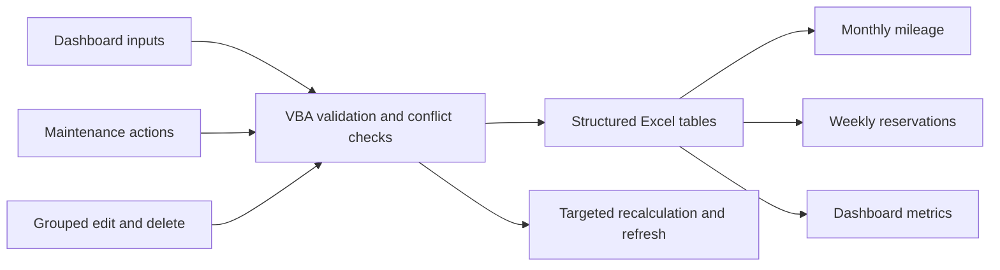

# Architecture

## Ownership and Design Goals

Charles Monsanto designed and implemented the application from requirements through public release. The architecture reflects five priorities:

1. Keep mileage, reservations, maintenance status, and reporting in one familiar desktop workflow.
2. Prevent invalid or conflicting transactions before they reach the source tables.
3. Derive reports from structured records instead of manually maintained summaries.
4. Preserve dated maintenance and transaction history for operational traceability.
5. Keep the solution lightweight, reviewable, and maintainable in standard Excel/VBA.

## Data Flow

## Workbook Layers

### Presentation

- **Dashboard:** mileage and reservation entry, maintenance actions, recent-entry correction controls, report selectors, and summary metrics.
- **Monthly Mileage:** fiscal-year history with trip counts, ending odometers, mileage totals, and dated maintenance status.
- **Weekly Reservations:** a Sunday-through-Saturday vehicle schedule showing timed bookings, multi-day reservations, and unavailable vehicles.

### Data

Excel `ListObject` tables provide the local data store:

- `tblVehicles`
- `tblDrivers`
- `tblReservations`
- `tblMileageLog`

A multi-day reservation is materialized as one row per vehicle-date so weekly views and date-specific conflict checks stay simple. The rows remain associated for grouped editing and deletion. Maintenance periods are also represented by date, preserving historical availability after a vehicle returns to service. The mileage log stores vehicle status on the trip date for the same reason.

The public workbook contains only synthetic demonstration records. There is no server, external database, API, add-in, or external data connection.

### Automation

- `modFleetMileageTool.bas` owns validation, table writes, reservation and maintenance rules, reporting, navigation, protection, and application-state controls.
- `modFleetDashboardLayout.bas` owns dashboard presentation and fiscal-year/report-month selectors.
- `modFleetUndoActions.bas` retains its compatibility filename and owns recent-entry selection, grouped reservation correction, deletion, and dependent recalculation.
- `ThisWorkbook.cls` initializes protection and dashboard state when the workbook opens.
- Worksheet modules contain thin event handlers that dispatch user actions to standard modules.

This separation keeps the workbook implementation compact while leaving the business logic available as plain-text source for review.

## Reservation Model

Reservations are evaluated by vehicle, date, status, and time interval.

- A single-day booking creates one dated row; a multi-day booking creates one row for every date in the inclusive date range.
- Multiple bookings for the same vehicle and date are valid when their time intervals do not overlap.
- Time intervals are half-open: `[start, end)`. In practical terms, 8:00 AM-12:00 PM and 12:00 PM-5:00 PM are adjacent, not conflicting.
- Two intervals conflict only when `newStart < existingEnd` and `existingStart < newEnd`.
- End time must be later than start time.
- A maintenance interval blocks reservations for the affected vehicle-date.
- Grouped edits omit the selected reservation rows from self-conflict checks, validate the replacement range, then add, update, or remove rows as needed.
- Grouped deletion removes the complete multi-day reservation rather than leaving orphaned dates.

## Mileage and Maintenance Rules

- Ending odometer must be greater than or equal to starting odometer.
- Saving mileage updates the vehicle's current odometer and affected reports.
- Editing or deleting mileage recalculates the related odometer from retained records.
- Maintenance start and return-to-service actions preserve a dated history.
- Historical status flows into the mileage log, monthly report, and weekly reservation view.

## Reports and Controls

Dashboard and report outputs are derived from source tables and include monthly miles, fiscal-year-to-date miles, trip days, trip counts, scheduled hours, weekly reservations, ending odometers, and current or historical maintenance status.

The control strategy combines constrained dashboard inputs, required-field and data-type validation, interval conflict checks, controlled corrections, protected generated sheets, and targeted refreshes. Excel events, calculation, and screen updating are restored on both success and error paths.

## Performance Approach

- Refresh only outputs affected by the completed transaction.
- Cache the weekly-reservation signature and rebuild when its source data changes.
- Suspend screen updating and events during controlled transitions.
- Keep calendars, selectors, recent-entry menus, and all business data local to the workbook.

## Sheet Module Map

| VBA component | Worksheet |
|---|---|
| `Sheet1` | Dashboard |
| `Sheet2` | Setup |
| `Sheet3` | Vehicles |
| `Sheet4` | Drivers |
| `Sheet5` | Reservations |
| `Sheet6` | Mileage Log |
| `Sheet7` | DashboardData |
| `Sheet8` | Monthly Mileage |
| `Sheet9` | Weekly Reservations |
| `Sheet10` | Import Summary |

Only application-facing sheets are visible during normal use. Supporting sheets remain hidden and are changed through controlled VBA routines.
